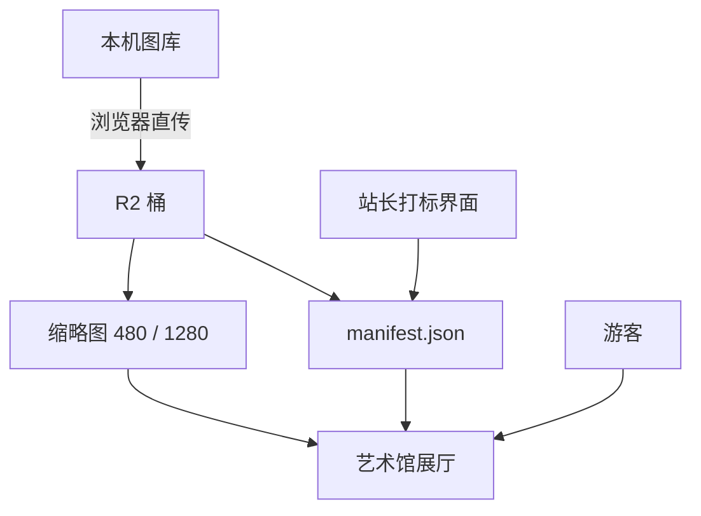

# 艺术馆与数字资产仓库 · 规格（草案 v0.1）

适用：艺术馆页面、图库上站、对象存储、资产生命周期。
状态：**草案**。标 ❓ 的是待老板拍板项，标 ✅ 的是已定项。
写入前读一遍；改规格就是改这份文件。

---

## 1. 定位

老板原话：「我可能更想表达的是类似那种线上硬盘空间？就是不只是图片，后续可能还有各种文件以及其他的代码管线资产、视频之类的。」

所以这里的产物不是「一个图片画廊」，而是：

> **一块线上的资产仓库（stulanez 私有云盘）＋ 一个读仓库的展厅（艺术馆）。**

- 仓库：对象存储里的一个桶，按资产域分区，任何文件类型都能放。
- 艺术馆：仓库的第一个消费方，只读清单渲染展厅。
- 关键约束：**站上页面永远只读清单**，不认识本机硬盘、不认识对象存储密钥。图片搬家、换 CDN、换云厂商，页面不用改一行。

✅ 已定：全库能力（图库里有什么，将来都能上站，由老板决定上哪些）。
❓ 待定：艺术馆与 `/gallery` 相册页的关系（合并 / 分工 / 关掉一个）。

## 2. 存储选型

价格核于 2026-09-17 官方页面：

| 方案 | 存储 | 出口流量 | 免费额度 | 国内直连 |
|---|---|---|---|---|
| **Cloudflare R2** | $0.015/GB·月 | **免费** | 10GB 存储 + 1000 万次读/月 | 一般 |
| Backblaze B2 | $6.95/TB·月 | 3× 存储量内免费 | 无 | 偏慢 |
| 阿里云 OSS | 0.09 元/GB·月 | 忙时 0.5、闲时 0.25 元/GB | 试用包 | 快 |
| 腾讯 COS | ≈0.118 元/GB·月 | ≈0.5 元/GB | 常有活动 | 快 |
| 七牛 / 又拍 | 10GB 级免费额度 | 额度内免费 | 10GB 存储 + 10~15GB/月 | 快 |

结论 ✅：**R2 做主力仓**。

- 存储费三者接近（50GB ≈ 5 元/月），**差别全在流量**：每月被看 200GB 时 R2 是 0 元，国内 OSS 约 100 元。
- S3 兼容 → 想搬家只改 endpoint。
- 仓库已有 `wrangler` 依赖与 Cloudflare 通道。
- 后路：将来国内访问成痛点，可挂国内 CDN **回源 R2**——R2 出口免费，回源不花钱，只付 CDN 流量（前提是域名备案）。
- 冷备：用 rclone 定期镜像一份到 B2 / 阿里归档，一个月几毛钱。

## 3. 仓库布局

单桶 `stulanez`，前缀分区（将来加视频/代码资产不用重设计）：

```
art/img/<hash前2位>/<hash>.<ext>        上站原图（内容哈希命名，天然去重）
art/thumb/<hash前2位>/<hash>-480.webp   展墙缩略图
art/thumb/<hash前2位>/<hash>-1280.webp  中图
art/manifest.json                       清单（公开读，唯一真相源）
lib/…                                   其他资产域（音乐 / 字体 / 视频 / 管线产物）
```

- 命名用**内容哈希**而非原文件名：重名不冲突、重复文件天然合并、改名不影响链接。
- 原图只在本机保留一份，对象存储里那份就是「上站版」（可另做尺寸压缩，见 §5）。

## 4. 清单 manifest（唯一真相源）

站上页面只认这个文件。格式 v1：

```jsonc
{
  "version": 1,
  "updatedAt": "2026-09-17T12:00:00.000Z",
  "generator": "art-scan/0.1",
  "baseUrl": "https://img.stulanez.com",
  "items": [
    {
      "id": "2f8a1c9d0e4b7a63",          // 内容哈希前 16 位
      "key": "art/img/2f/2f8a….jpg",
      "thumbs": {
        "480": "art/thumb/2f/2f8a…-480.webp",
        "1280": "art/thumb/2f/2f8a…-1280.webp"
      },
      "width": 3840, "height": 2160, "bytes": 3150000, "format": "jpeg",
      "ratio": "16:9",
      "auto": {
        "uses": ["桌面壁纸", "横幅"],      // 管线自动判定：用途
        "grade": "4K",                     // 分辨率等级：8K/4K/2K/1080P/低清
        "colors": ["#1b2733", "#8fa3b8"],  // 主色 5 个（3 位/通道量化）
        "dhash": "a3f01c…",                // 感知哈希，查视觉相似
        "brightness": 0.42,
        "saturation": 0.35,
        "hasExif": true,
        "faces": null,                     // 视觉模型接入后填
        "nsfw": null
      },
      "tags": {                           // 人工轴，管线只留空位
        "category": "", "group": "", "member": "",
        "style": "", "source": "", "year": "", "theme": []
      },
      "public": false,                    // 默认不上站，老板勾选才 true
      "addedAt": "2026-09-17",
      "origin": {
        "path": "壁纸/LOL/xxx.jpg",        // 只记相对路径，本机绝对路径不进清单
        "duplicates": []                  // 同内容不同文件名时，其余来源记这里
      }
    }
  ]
}
```

✅ 已定：`public` 默认 `false`（**图库里的东西在你亲眼确认前不会自己跑到公网**）。老板表述为「我来选择链接文件夹，然后再往上传」。

## 5. 双向打标

### 5.1 管线自动轴（不需要人动手）

| 判据 | 自动得出 |
|---|---|
| 比例 16:9 / 16:10（相对容差 5%） | 桌面壁纸 |
| 比例 9:16 / 9:19.5（相对容差 5%） | 手机壁纸 |
| 比例 21:9 | 超宽壁纸 |
| 比例 3:2 / 4:3 | 摄影原图（相机原生比例） |
| 比例 4:5 / 3:4 | 社交背景 |
| 比例 1:1 | 方图；短边 ≤1024 兼「头像」，≤400KB 兼「表情包」 |
| 未命中任何档 | 按方向兜底：长图 / 竖图 / 方图 / 横图 / 全景 |
| 长边 <1280 | 仅预览，不够上站 |
| 长边 ≥2560 / ≥3840 / ≥7680 | 2K / 4K / 8K 等级（单独一维） |
| 主色量化（3 位/通道） | 配色标签、展厅配色 |
| 感知哈希 dhash | 查视觉相似；sha1 相同则为字节级重复 |
| EXIF 有无 | 拍摄信息标记 |

> ⚠️ **比例判定必须用相对容差，不能写死区间。** 曾经写死「1.7～1.9 才算 16:9」，结果 `4000×2360`（1.6949，只差 4.6%）那张暗星烬壁纸被劈到另一类，用户一眼就看出不对。同一批壁纸不该因为下载源给的像素不同而分家。

二期（接入视觉模型后可加）：人脸数 / 人物数、NSFW 概率、内容描述、画面风格初判。

**两端实现的一致性**（2026-09-17 实测）。判定规则只有一份（`src/utils/art-rules.ts`），但两端的像素处理不同：

| 项 | 本地管线（sharp） | 浏览器策展台（canvas） | 结论 |
|---|---|---|---|
| id（内容 sha1） | `7f9d7d0f5197fb45` | `7f9d7d0f5197fb45` | ✅ 完全一致，两套清单可混用 |
| 用途 / 等级 / 比例 | 桌面壁纸 / HD / 16:9 | 同 | ✅ 一致 |
| dhash | `c6d4ede…` | `a674e5f…` | ❌ 不同（缩放算法与色彩管理差异） |
| 主色 | 集合重叠、排序不同 | | ⚠️ 近似 |

含义：**分类与内容去重一致；视觉相似提示与配色会有差异**。dhash 只用于「疑似同图」提示、不参与 id，因此不影响正确性。

### 5.2 人工轴（老板在艺术馆界面里打）

团体、成员、画风、来源、年份、主题、**以及最终裁决「这张上不上站」**。

管线给客观事实，人给意义与取舍。

## 6. 动线



- **站长动线**：在有站长权限的设备打开 `/art/` → 进入策展模式 → 选文件夹（File System Access API）→ 浏览器就地读图、算哈希、压缩略图 → 拿预签名 URL 直传 R2 → 更新 manifest → 顺手打标。
- **游客动线**：打开 `/art/` → 展厅（按分类/团体/成员/用途）→ 展墙 → 灯箱大图 → 下载 / 收藏；**看不到任何维护入口**（协议「站长与游客」）。

## 7. 访问与鉴权

| 面向 | 方式 |
|---|---|
| 游客读图 | `img.stulanez.com`（R2 自定义域 + Cloudflare 缓存，公开读） |
| 游客读清单 | 同上，`art/manifest.json` |
| 站长写（上传/改标） | 预签名 URL，由轻接口签发；密钥只在服务端环境变量 |
| 签名接口鉴权 | ❓ 先用「站长口令」共享密钥（简单、零依赖）；需要更严再上 Cloudflare Access |

**必读风险**：站长设备识别（`src/utils/owner.ts`）是 localStorage 标记，**客户端可伪造**，只能用来决定「界面显不显示」，绝不能用来决定「允不允许写」。写权限必须另有一层真校验。

## 8. 风险与对策

| 风险 | 对策 |
|---|---|
| 私藏/版权图被公开托管 | `public` 默认 false；上站前逐批确认；来源字段留痕 |
| 直链盗用 | 需要时改成 Worker 代理 + 签名 URL（免费额度内够用） |
| NSFW | 上站前人工过一遍；二期加模型打分 |
| 上行带宽 | 并发上传 + 断点续传 |
| 孤儿展品（本机删了、站上还在） | manifest 校验脚本定期比对 |
| 仓库膨胀 | 图片不进 git；现有 `public/assets/music` 235MB 也在迁移候选里 |
| 密钥泄漏 | 只在服务端环境变量与本机 `.env.local`；不进仓库、不进日志 |

## 9. 路线图

- ✅ **阶段 0（2026-09-17）**：清单格式定稿；判图管线 `scripts/art-scan.ts` 跑通（规则抽到 `src/utils/art-rules.ts`，与浏览器端共用）；`scripts/art-preview.mjs` 能把清单渲染成展墙预览页。
  - 实测 `素材/壁纸`：32 张 → **31 条**（合并 1 组字节级重复），6.6 秒；缩略图 480 宽 **11–19KB**、1280 宽 50–72KB。
  - 实测 `public/assets/images`：345 张 → **313 条**（合并 32 组重复，多为抖音名单头像占位图）。
- ✅ **阶段 1（2026-09-17）**：艺术馆拆两层——`ArtGallery`（游客展厅，读 `/art/manifest.json`）+ `LocalLibrary`（站长专属本机全库）；首批 62 件展品上线。
- 🚧 **阶段 3 前半（2026-09-17）**：策展台 `src/components/art/CurateDesk.svelte` 落地——浏览器内选本地图库、判图（与本地管线共用 `art-rules.ts`）、批量打标、写回展品目录。**「上传」那一步等阶段 2 接入 R2 后替换掉「写回目录」**，其余流程不变。
- ⏳ **阶段 2**：开 R2 桶 + `img.stulanez.com` + 签名接口，打通浏览器直传。
- ⏳ **阶段 4**：扩成通用资产仓库（音乐/视频/管线产物迁入），艺术馆接二期视觉判图。

## 10. 待定问题

1. `/gallery` 相册页保留、改造还是下线？
2. 上站版图片是否压缩（长边上限 / 质量 / 格式）？还是原图直传？
3. 游客能否下载原图？还是只给「上站版」或只给看图？
4. 签名接口鉴权：口令 还是 Cloudflare Access？
5. 是否需要「定期换展」概念，还是长期陈列 + 手动上下架？
6. 域名是否备案（决定将来能否挂国内 CDN）。

## 附：多人共用同一工作区时的注意

- **不要跑 `pnpm build`**：它会重写 `src/constants/lqips.json`（把 public 下新增图片全量收录）与 `src/constants/github-card-data.json`（联网拉 GitHub 数据，网络不稳时会丢条目），从而污染其他协作者的未提交状态。验收改用 `pnpm check` / `pnpm type-check`（这两个都不写文件）加 dev 目视。
- 已发生过的实例（2026-09-17）：一次 build 给 lqips.json 加了 125 行，并删掉了 github-card-data.json 里的 `saicaca/fuwari` 条目；两处均已按原样还原。

---

来源：本次与老板的讨论、R2 / B2 / 阿里云 OSS 官方定价页（2026-09-17 核）、`docs/ai/assets.md`、`src/content/posts/site-protocol.mdx`。
